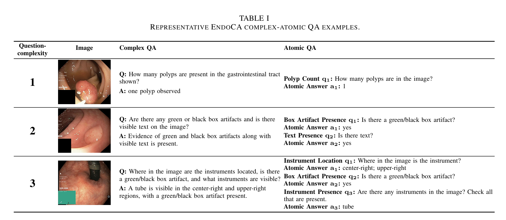
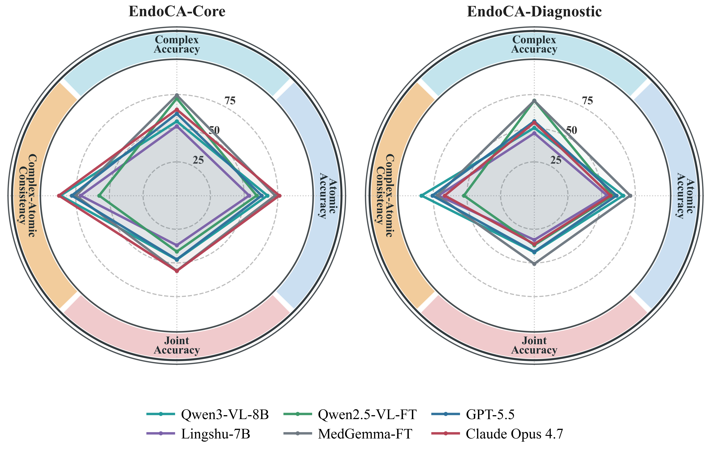
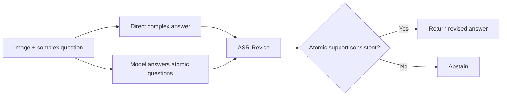
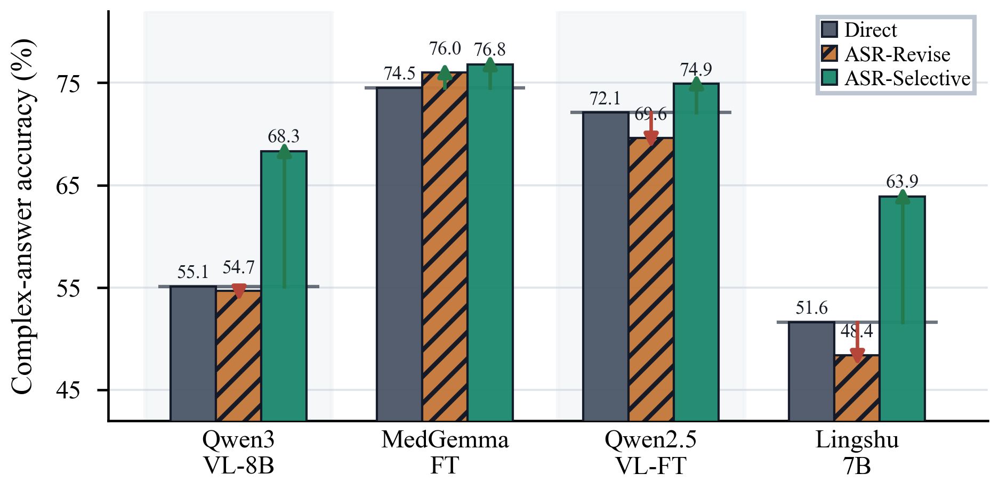

<div align="center">

# EndoCA

### Complex-Atomic Answer Consistency in Endoscopic VQA

**Yuhao Liu, Cheng Zhao, Guanghui Yue**  
School of Biomedical Engineering, Shenzhen University, Shenzhen, China

[Paper (arXiv identifier pending)](#citation) | [Chinese README](docs/README_zh.md) | [Data Guide](docs/data.md)

[](pyproject.toml)
[](LICENSE)
[](NOTICE)

</div>

Endoscopic VQA models can produce a correct complex answer while failing simpler questions about the same image. **EndoCA** evaluates this hidden gap by pairing every complex question with its associated atomic questions. **Atomic-Support Reconciliation (ASR)** is a training-free method that uses a model's own atomic answers to revise a complex answer or abstain when support is unreliable.

<p align="center">
  
</p>

## Highlights

- **Two paired benchmarks.** EndoCA-Core provides the main 12,000-sample evaluation; EndoCA-Diagnostic adds a controlled question-complexity axis over 6,000 distinct samples.
- **Consistency-aware metrics.** Report complex accuracy, atomic accuracy, joint accuracy, and complex-atomic inconsistency together.
- **Training-free reconciliation.** ASR-Revise reconciles complex answers with model-generated atomic premises; ASR-Selective exposes a reliability-coverage trade-off.

| Suite | Complex samples | Atomic questions | Total model queries | Intended use |
|---|---:|---:|---:|---|
| EndoCA-Core | 12,000 | 15,736 | 27,736 | Main model comparison and ASR evaluation |
| EndoCA-Diagnostic | 6,000 | 9,300 | 15,300 | Controlled analysis by question complexity |

## EndoCA At A Glance

Each EndoCA sample links one complex question to the atomic questions that support its answer. The examples below show this pairing at question-complexity levels 1, 2, and 3.

<p align="center">
  
</p>

## Installation

```bash
git clone https://github.com/Luious-LYH/EndoCA-VQA.git
cd EndoCA-VQA
conda create -n endoca python=3.11 -y
conda activate endoca
pip install -e .
python -m endoca.data.prepare
```

The last command extracts and verifies the two bundled manifests. Download the public Kvasir-VQA-x1 images from its [official repository](https://github.com/simula/Kvasir-VQA-x1), then point `--data-root` to the directory containing `Kvasir-VQA-x1/`.

Install PyTorch for your CUDA version before using a local VLM. The optional helpers used in our tested environment can be installed with `pip install -e ".[vlm]"`.

## Use The Benchmarks

Each manifest row is either a `complex_direct` query or an associated `atomic_direct` query. You can use any VLM as long as its output JSONL retains the manifest fields and adds `model_id`, `prediction`, and an optional `error` string.

Example with one configured open model:

```bash
python -m endoca.inference.open_vlm \
  --config configs/models.yaml \
  --model qwen3-vl-8b \
  --input data/manifests/endoca_core.jsonl \
  --output outputs/qwen3_core.jsonl \
  --data-root /path/to/datasets \
  --prompt-style answer_only \
  --max-new-tokens 80
```

`configs/models.yaml` contains concise examples for the models evaluated in the paper. Other models can be used directly with `--model-id` and `--adapter`; environment and device choices remain under the user's control. API models use the analogous `python -m endoca.inference.api_vlm` entry point and read credentials only from the environment variable named by `--api-key-env`.

Score one or more prediction files:

```bash
python -m endoca.evaluation.score \
  --predictions outputs/qwen3_core.jsonl \
  --out-jsonl outputs/qwen3_core_scored.jsonl \
  --out-metrics outputs/qwen3_core_metrics.json \
  --out-report outputs/qwen3_core_report.md
```

The scorer is deterministic and question-type-aware. Empty outputs, execution errors, ambiguous answers, and non-committal responses are counted as incorrect.

<p align="center">
  
</p>

## Use ASR

ASR starts from a model's scored complex and atomic predictions. It builds an input manifest without exposing gold answers or correctness fields to the reconciliation prompt.



Build ASR inputs and run reconciliation:

```bash
python -m endoca.asr.build \
  --scored-jsonl outputs/qwen3_core_scored.jsonl \
  --target-model-id Qwen/Qwen3-VL-8B-Instruct \
  --model-slug qwen3-vl-8b \
  --out-jsonl outputs/qwen3_asr_input.jsonl \
  --out-report outputs/qwen3_asr_input.md

python -m endoca.asr.run \
  --model-id Qwen/Qwen3-VL-8B-Instruct \
  --input outputs/qwen3_asr_input.jsonl \
  --output outputs/qwen3_asr.jsonl \
  --adapter qwen3_vl \
  --max-new-tokens 120
```

Use `python -m endoca.asr.score --help` to score Direct, ASR-Revise, and ASR-Selective together.

<p align="center">
  
</p>

## Released Results

Compact paper-facing tables are under [`results/paper/`](results/paper/README.md). They use the public metric names from the paper and exclude internal paths and runtime metadata. Full raw model outputs are intentionally not part of the Git repository because of size and third-party provider terms.

## Data And License

The code is released under [Apache-2.0](LICENSE). EndoCA manifests are derived from Kvasir-VQA and Kvasir-VQA-x1 and remain subject to the upstream CC BY-NC 4.0 terms described in [NOTICE](NOTICE). This benchmark is intended for research evaluation and is not a clinical decision-making system.

## Citation

The arXiv identifier is still pending. Please replace the placeholder once the public record is available.

```bibtex
@article{liu2026endoca,
  title   = {Measuring and Improving Complex-Atomic Answer Consistency in Endoscopic VQA},
  author  = {Liu, Yuhao and Zhao, Cheng and Yue, Guanghui},
  journal = {arXiv preprint arXiv:XXXX.XXXXX},
  year    = {2026}
}
```

If EndoCA or ASR is useful in your work, please consider citing the paper.
